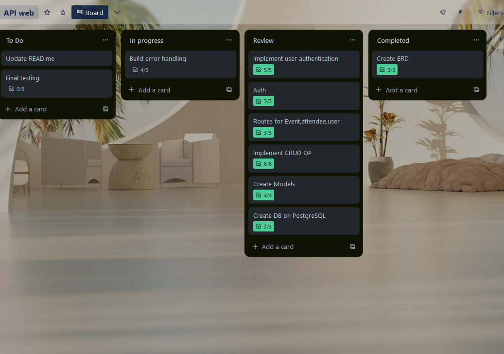
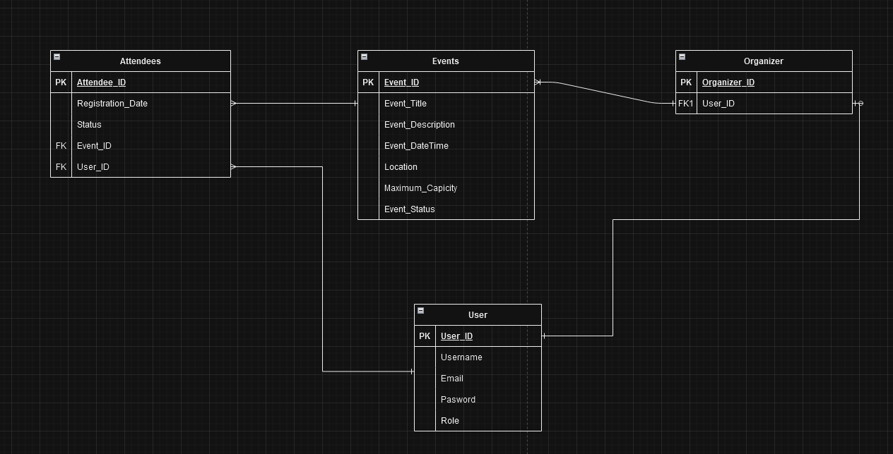

# API Webserver
## R1 Explain the problem that this app will solve, and explain how this app solves or addresses the problem.

#### Event Management and Registration:
To arrange and handle events is not a simple job. It needs many steps like creating events, managing registrations, tracing attendees, and making sure that all data is saved correctly for easy access when required. Those who participate in the event may also find it difficult to locate an event, register for it and keep track of events they are interested in.
##### Common Issues:
* Event Organization: Coordinating event details like date, time, location, and capacity.
* Registration Management: Handling attendee registrations, including confirming attendance and managing capacities.
* User Management: Ensuring secure user data handling, including roles for organizers and attendees.
#### Solution Overview
The suggested app tackles these problems head-on with a robust event management framework. Users can generate, handle and sign up for events through this system. Let's see how it resolves the particular issues:
##### Event Creation and Management:
* Event Details: Those who arrange events can make events with all the needed details like title, description, date and time, place, organizer details, capacity and status.
* CRUD Operations: The application allows for Create, Read, Update and Delete (CRUD) operations on events. Organizers can effectively handle event details.
##### Registration Management:
* Registration of Attendees: People can sign up for events, and the application will keep a record of their registration information such as status and extra details.
* Capacity Management: The app aids in managing the capacity of an event. It avoids excessive registration and assists with handling attendees effectively.
##### User Management:
* User Roles: The system differentiates between organizers and attendees in order to allow the right access and functionalities based on user roles.
* Data Handling that is Secure: The application manages user data safely by saving passwords in hashed form and guaranteeing protection for all user details.
#### Detailed Breakdown
##### Event Management:
* Create Events: Organizers can make new events by giving needed details. The plan for the event takes care of the method to include events into database.
* View Events: The event blueprint shows a list of all events to both the people who organized them and those attending. Event data is fetched from database by the event blueprint and presented in an easy-to-understand manner.
* Update Events: If there are any changes, organizers can alter event details. The event blueprint is responsible for saving updated information in a correct manner.
* Delete Events: If there are events that have passed or become irrelevant, organizers have the ability to delete them. This helps in maintaining an updated and relevant list of events.
##### User Management:
* Register Users: For new users to sign up, they should give a username, an email and a password. The user blueprint makes sure this information is kept safe.
* Roles for Users: People using the app may possess different roles, like "organizer" or "attendee", that impact their abilities within this application.
* User Authentication: Users can log in securely, with their credentials verified against stored data.
##### Attendee Management:
* Event Registration: People can register for events they want to participate in. The attendee blueprint controls the registration details, linking persons with events.
* Track Registration: The app knows who comes to each event and handles their registration.
* Manage Capacity: The app stops over-registration by verifying the event's maximum capacity before accepting new registrations.

This app makes it easier to organize and handle events, giving a simple solution for those who arrange the event as well as people participating in it. It manages event details, user information and registration processes effectively. The app is easy to use, dealing with typical problems encountered when managing an event

## R2 Describe the way tasks are allocated and tracked in your project
For my project, I used GitHub Projects and Trello to manage the task allocation and tracking. 

Along with this, I kept a Trello board for wider view and adaptability in organizing tasks. In Trello, you can make the job look more dynamic by using lists to show stages like Backlog or In Progress Testing Completed. Every task card on Trello had detailed descriptions, attachments and links to related GitHub issues or pull requests for smooth movement between project management and code creating areas.

I used a method of making due dates that can be changed in GitHub Projects and Trello. This helped to manage tasks in an agile way, allowing me to put importance on tasks according to their time limits and the project's movement instead of only following fixed deadlines. The ability for flexibility was very important so as to adjust with iterative development processes and changing priority rankings.

Working in sync with task control, Git has been employed as a strong version controlling method. I made constant commits for keeping records of project alterations, guaranteeing ongoing backup and monitoring my performance speed during the assignment. The version history of Git gave me important understanding about how the project is progressing and acted as a stopover to fine-tune workflows while improving strategies for managing tasks efficiently.





## R3 List and explain the third-party services, packages and dependencies used in this app.

1. Alembic (1.13.2)

    Purpose: Database migrations.
    Use: Manages schema changes over time using migrations, which are version-controlled updates to the database schema.

2. Blinker (1.8.2)

    Purpose: Signal handling.
    Use: Implements a signaling framework for event-driven programming, often used in Flask for event notifications.

3. Click (8.1.7)

    Purpose: Command-line interface (CLI) creation.
    Use: Facilitates writing simple and complex command-line interfaces for scripts.

4. Flask (3.0.3)

    Purpose: Web framework.
    Use: Core framework for building web applications in Python.

5. Flask-JWT-Extended (4.6.0)

    Purpose: JWT authentication.
    Use: Adds support for JSON Web Tokens (JWTs) for securing routes and handling authentication.

6. Flask-Marshmallow (1.2.1)

    Purpose: Object serialization/deserialization.
    Use: Integrates Marshmallow with Flask to handle the serialization of objects to JSON and vice versa.

7. Flask-Migrate (4.0.7)

    Purpose: Database migrations.
    Use: Extension for handling database migrations using Alembic with Flask applications.

8. Flask-SQLAlchemy (3.1.1)

    Purpose: Database integration.
    Use: Simplifies database interactions by integrating SQLAlchemy with Flask, providing ORM capabilities.

9. Greenlet (3.0.3)

    Purpose: Lightweight concurrent programming.
    Use: Used internally by libraries like Gevent to manage lightweight, in-process threads.

10. Itsdangerous (2.2.0)

    Purpose: Data security.
    Use: Provides a way to sign data to ensure it hasn’t been tampered with, often used in session management.

11. Jinja2 (3.1.4)

    Purpose: Templating engine.
    Use: Renders HTML templates with dynamic data in Flask applications.

12. Mako (1.3.5)

    Purpose: Templating engine.
    Use: An alternative templating engine to Jinja2, known for performance and flexibility.

13. MarkupSafe (2.1.5)

    Purpose: HTML escaping.
    Use: Ensures that strings are safe for rendering in HTML by escaping special characters.

14. Marshmallow (3.21.3)

    Purpose: Object serialization/deserialization.
    Use: Handles serialization of Python objects to JSON format and validation of incoming data.

15. Marshmallow-SQLAlchemy (1.0.0)

    Purpose: SQLAlchemy integration.
    Use: Extends Marshmallow to work with SQLAlchemy models, simplifying schema creation.

16. Packaging (24.1)

    Purpose: Package version handling.
    Use: Used for parsing and handling package versions, dependencies, and packaging-related tasks.

17. Psycopg2-binary (2.9.9)

    Purpose: PostgreSQL adapter.
    Use: Allows Python applications to connect to PostgreSQL databases using a binary distribution.

18. PyJWT (2.8.0)

    Purpose: JWT encoding/decoding.
    Use: Used to encode and decode JSON Web Tokens for secure transmission of information.

19. Python-dotenv (1.0.1)

    Purpose: Environment variable management.
    Use: Loads environment variables from a .env file, useful for configuration management.

20. SQLAlchemy (2.0.31)

    Purpose: Database ORM.
    Use: Provides a full suite of tools for working with relational databases using an ORM.

21. Typing-Extensions (4.12.2)

    Purpose: Type hinting.
    Use: Provides backports of type hints and other typing features for older versions of Python.

22. Werkzeug (3.0.3)

    Purpose: WSGI utilities.
    Use: Offers various utilities for creating WSGI-compatible web applications, including request/response handling.

## R4 Explain the benefits and drawbacks of this app’s underlying database system.

#### Benefits

1. #### Relational Database Capabilities:

* Data Integrity: PostgreSQL keeps data integrity using constraints like primary keys, foreign keys, and others that help in maintaining dependable relationships between tables (for instance Event, User, Attendee).

* ACID Compliance: This means it is reliable for transactions (Atomicity, Consistency, Isolation, Durability), which are very important in keeping data consistency within multiple step operations.

2. #### Scalability and Performance:

* Horizontal Scalability: This can be made to scale horizontally by methods such as sharding and replication, which distribute data across many nodes for better capacity and performance.

* Advanced Indexing: This allows for different methods of indexing (like B-tree, GIN, GiST) which are very useful in enhancing the speed of queries. It is especially advantageous when dealing with complicated queries and big datasets.

3. #### Extensibility and Ecosystem:

* Large ecosystem: Brings many extensions and integrations (such as spatial data using PostGIS, full-text search via pg_trgm) that boost functionality and adaptability of applications.

* Active community: PostgreSQL has a big and active community that provides support, plugins, and ongoing enhancements.

#### Drawbacks

1. #### Setup and Administration Complexity:

* Initial setup: Configuring PostgreSQL could be more complicated compared to simpler databases, needing knowledge in database administration and possibly longer time for setting up.

* Administration: Needs regular care (such as backups, performance adjustments, security upgrades) to guarantee best functioning and dependability.

2. #### Concurrency and Locking:

* Managing concurrency: Managing concurrent access to data and making sure locking methods are used properly is crucial for preventing contention and loss in performance.

* Transaction isolation levels: Selection of right levels of isolation (like READ COMMITTED, REPEATABLE READ) for achieving a trade-off between data consistency and performance.

3. Resource Consumption:

* Operations that require a lot of resources: Certain advanced features and query optimizations could use more resources like CPU or memory, so they need to be properly provisioned and checked.


#### Summary


## R5 Explain the features, purpose and functionalities of the object-relational mapping system (ORM) used in this app.

### Features of SQLAlchemy ORM

1. **Declarative Base**: SQLAlchemy allows the definition of database tables as Python classes (`User`, `Event`, `Attendee`). Each class represents a table, and each instance of the class represents a row in that table. This makes it easy to work with database entities as native Python objects.

2. **Relationships**: SQLAlchemy provides powerful support for defining relationships between tables using attributes like `db.relationship`. For example:
   * `User.events` defines a one-to-many relationship where a user can organize multiple events (`Event.organizer_id` references `User.user_id`).
   * `Event.attendees` defines a one-to-many relationship where an event can have multiple attendees (`Attendee.event_id` references `Event.event_id`).

3. **Column Types and Constraints**: SQLAlchemy supports various column types (`db.Column`) such as `Integer`, `String`, `Text`, `DateTime`, etc., and constraints like `primary_key`, `nullable`, `unique`, etc., which define the structure of database tables.

4. **Query Building**: SQLAlchemy allows the construction of database queries using Pythonic syntax (`db.session.query`). This includes basic CRUD operations (Create, Read, Update, Delete) and complex queries involving joins, filters, and aggregations.

5. **Session Management**: SQLAlchemy manages database connections and transactions through its `Session` object (`db.session`). It facilitates the management of database transactions, ensuring data consistency and integrity.

6. **Schema Generation**: SQLAlchemy can generate database schema (`db.create_all()`) based on your model definitions. This automates the creation of database tables, columns, and constraints according to the defined models.

### Purpose

The main purpose of using SQLAlchemy ORM in this application is to bridge the gap between relational databases and Python, providing a high-level interface for interacting with databases. Key purposes include:

* **Abstraction of SQL**: SQLAlchemy abstracts SQL database interactions into Python classes and methods, making it easier to work with databases using familiar Python syntax.

* **Code Organization**: ORM promotes a clean and organized code structure by encapsulating database logic within model classes (`User`, `Event`, `Attendee`) and schemas (`UserSchema`, `EventSchema`, `AttendeeSchema`).

* **Portability**: SQLAlchemy's dialect-based approach allows seamless migration between different SQL databases (SQLite, PostgreSQL, MySQL) without major changes to the application logic.

* **Security**: SQLAlchemy helps prevent SQL injection attacks by parameterizing queries and sanitizing inputs automatically.

### Functionalities in the Application

* **Model Definitions**: Classes (`User`, `Event`, `Attendee`) define the structure of database tables and their relationships (`db.relationship`).

* **Schema Definitions**: `SQLAlchemyAutoSchema` subclasses (`UserSchema`, `EventSchema`, `AttendeeSchema`) define how SQLAlchemy models should be serialized to and deserialized from JSON, facilitating data validation and transformation.

* **Relationship Management**: SQLAlchemy manages relationships between tables (`db.relationship`) such as one-to-many and many-to-one relationships, ensuring data consistency and referential integrity.

* **Data Persistence**: SQLAlchemy's `db.session` handles transactions (`commit()`, `rollback()`) and manages the lifecycle of database objects (`add()`, `delete()`), ensuring atomicity and data integrity during database operations.

Overall, SQLAlchemy ORM simplifies database interactions, enhances code readability and maintainability, and provides robust support for building scalable Flask applications with relational databases. It leverages Python's strengths to provide a powerful, yet intuitive interface for working with SQL databases.

For applications that need strong relational database features, can grow in size and require transactional consistency, PostgreSQL is a good option. It provides lots of functions for managing data and improving performance. Also, it has a helpful community and can be extended easily. But developers must consider the difficulty of setting up system, managing administration tasks as well as dealing with problems linked to concurrency and resource control.

## Explain the features, purpose and functionalities of the object-relational mapping system (ORM) used in this app.

## R6 Design an entity relationship diagram (ERD) for this app’s database, and explain how the relations between the diagrammed models will aid the database design.



### ERD Overview
1. Entities:
    * User: Contains user information like Username, Email, Password, and Role.
    Organizer: Represents users who manage events, linked to User.
    * Events: Details about events, including Title, Description, DateTime, Location, Capacity, and Status.
    * Attendees: Tracks event attendance, with Registration Date and Status.
2. Relationships:
    * User to Organizer: One-to-one relationship; each organizer is a user.
    * User to Attendees: One-to-many relationship; users can be attendees for multiple events.
    * Events to Attendees: Many-to-many relationship; events have multiple attendees, and users can attend multiple events.
    * Organizer to Events: One-to-many relationship; each organizer manages multiple events.

### How Relationships Aid Database Design
1. Data Integrity:
    * Foreign keys enforce data consistency, ensuring that every organizer and attendee corresponds to a valid user.
2. Scalability:
    * Supports multiple events and attendees without data duplication, accommodating growth in users and events.
3. Flexibility:
    * Users can serve multiple roles (attendee or organizer), simplifying user management and permissions.
4. Normalization:
    * Reduces data redundancy by organizing data into related tables, simplifying maintenance and updates.
5. Security:
    * Role-based access can be implemented, securing sensitive information based on user roles.

## R7 Explain the implemented models and their relationships, including how the relationships aid the database implementation. This should focus on the database implementation AFTER coding has begun, eg. during the project development phase.

Relationships and Their Benefits
1. One-to-Many Relationship (Event to Attendees):
    * Definition: An Event can have multiple Attendees, but each Attendee is associated with one Event.
    * Implementation: This is implemented using db. relationship in the Event model and db.ForeignKey in the Attendee model.
        * Benefits:
            * Data Organization: Allows the database to manage the list of attendees for each event efficiently.
            * Query Optimization: Facilitates querying all attendees for a specific event, which is useful for event management and reporting.
            Integrity: Ensures that an attendee cannot exist without an associated event, maintaining data integrity.

2. One-to-Many Relationship (User to Attended Events):
    * Definition: A User can attend multiple Events, but each Attendee record is associated with one User.
    * Implementation: This is implemented using db.relationship in the User model and db.ForeignKey in the Attendee model.
        * Benefits:
            * User Activity Tracking: Helps in tracking which events a user has attended.
            * Personalization: Facilitates personalized user experiences by analyzing user participation in events.
            * Data Consistency: Ensures that attendance records are consistently linked to valid users.

Practical Usage During Project Development
During project development, the defined models and relationships assist in various aspects:
1. CRUD Operations:
    * Create: Easily create events and associate attendees with them. The relationships ensure that attendees are linked to valid events and users.
    * Read: Efficiently retrieve events along with their attendees, or fetch all events a specific user has attended.
    * Update: Update event details or attendee information while maintaining relational integrity.
    * Delete: Safely delete events, ensuring that associated attendees are also handled appropriately (e.g., using cascading deletes if configured).

2. Data Validation and Integrity:
    * Foreign Keys: Ensure that references to events and users in the Attendee table are valid.
    * Constraints: Enforce constraints such as unique user emails, preventing duplicate entries.
3. Performance Optimization:
    * Indexes: Use indexes on foreign keys (event_id and user_id) to speed up queries.
    * Lazy Loading: Optimize performance by loading related data only when needed, using the lazy=True option in relationships.
4. Scalability and Maintenance:
    * Modularity: Keeping the models modular helps in scaling the application. Adding new features (e.g., event categories, user roles) becomes easier.
    * Maintainability: Clearly defined relationships and models improve code readability and maintainability.

## R8

#### Users

1. **Register User**
   * **HTTP Verb**: POST
   * **Route Path**: `/users/register`
   * **Required Body Data**:

     ```json
      {
     
      "username": "First_User",
      "email": "firstuser.doe@example.com",
      "password": "securepassword",
      "role": "user"

      }
     ```

   * **Success Response** 201 OK:

     ```json
      {
      "username": "First_User",
      "email": "firstuser.doe@example.com",
      "password": "securepassword",
      "role": "user"
      }
     ```

   * **Failure Response**:
   * 409 Conflict:

     ```json
      {
         "msg": "User already exists"
      }
     ```

   * 400 Bad Request:

     ```json
      {
        "msg": "Validation msgs"
      }
     ```

   2. **Login User**
      * **HTTP Verb**: POST
      * **Route Path**: `/users/login`
      * **Required Body Data**:

        ```json
         {
         "username": "First_User",
         "password": "securepassword"
        }
        ```

      * **Success Response** 200 OK:

        ```json
         {
           "token": "<your_jwt_token>"
         }
        ```

      * **Failure Response**:
      * 401 Unauthorized:

        ```json
        {
          "msg": "Invalid username or password"
        }
        ```

      * 400 Bad Request:

        ```json
        {
          "msg": "Validation msgs"
        }
        ```

3. **Get All Users**
   * **HTTP Verb**: GET
   * **Route Path**: `/users/`
   * **Required Header**: `Authorization: Bearer <your_jwt_token>`

   * **Success Response** 200 OK:

     ```json
     {
       "username": "First_User",
      "email": "firstuser.doe@example.com",
      "password": "securepassword",
      "role": "user"
     }
     ```

   * **Failure Response**:
   * 403 Forbidden:

     ```json
     {
       "msg": "You must be an admin to access "
     }
     ```

   * 400 Unauthorized:

     ```json
     {
       "msg": "Validation msgs"
     }
     ```

4. **Get One User**
   * **HTTP Verb**: GET
   * **Route Path**: `/users/<int:id>`
   * **Required Header**: `Authorization: Bearer <token>`

   * **Success Response** 200 OK:

     ```json
      {
       "username": "First_User",
      "email": "firstuser.doe@example.com",
      "password": "securepassword",
      "role": "user"
      }
     ```

   * **Failure Response**:
   * 404:

     ```json
     {
       "msg": "User not found"
     }
     ```

   * 400 Unauthorized:

     ```json
     {
       "msg": "Missing Authorization Header"
     }
     ```

5. **Update User**
   * **HTTP Verb**: PUT/PATCH
   * **Route Path**: `/users/<int:id>`
   * **Required Header**: `Authorization: Bearer <token>` (Owner only)

   * **Required Body Data**:

     ```json
      {
        "username": "updatedusername",
        "email": "updatedemail@example.com",
        "password": "newpassword",
        "role": "user"
      }
     ```

   * **Success Response** 200 OK:

     ```json
      {
        "username": "updatedusername",
        "email": "updatedemail@example.com",
        "password": "newpassword",
        "role": "user"
      }
     ```

   * **Failure Response**:
   * 403 Forbidden:

     ```json
     {
       "msg": "resource un accessible"
     }
     ```

   * 400 Unauthorized:

     ```json
     {
       "msg": "Validation msgs"
     }
     ```

   * 409 Conflict:

     ```json
     {
       "msg": "Username already exists"
     }
     ```

6. **Delete User**
   * **HTTP Verb**: DELETE
   * **Route Path**: `/users/<int:id>`
   * **Required Header**: `Authorization: Bearer <token>`

   * **Success Response** 204 No Content:

     ```json
     {}
     ```

   * **Failure Response**:
   * 403 Forbidden:

     ```json
     {
      "msg": "resource un accessible"
     }
     ```

   * 404 Not Found:

     ```json
     {
       "msg": "Not Found"
     }
     ```

#### Events

1. **Get All events**
   * **HTTP Verb**: GET
   * **Route Path**: `/events/`
   * **Required Header**: `Authorization: Bearer <token>`
   * Retrieves all events from the database

   * **Success Response** 200 OK:

     ```json
      {
        "date_time": "2024-07-01T10:00:00",
        "description": "This is a test event.",
        "event_id": 2,
        "location": "Test Location",
        "max_capacity": 100,
        "status": "upcoming",
        "title": "Test Event"
      }
     ```

   * **Failure Response** 401 Unauthorized:

     ```json
     {
       "msg": "Missing Authorization Header"
     }
     ```

2. **Get One Event**
   * **HTTP Verb**: GET
   * **Route Path**: `/events/<int:id>`
   * **Required Header**: `Authorization: Bearer <token>`
   * Retrieves a specific event by its event_ID

   * **Success Response** 200 OK:

     ```json
      {
        "date_time": "2024-07-01T10:00:00",
        "description": "This is a test event.",
        "event_id": 2,
        "location": "Test Location",
        "max_capacity": 100,
        "status": "upcoming",
        "title": "Test Event"
      }
     ```

   * **Failure Response** 404 Not Found:

     ```json
     {
       "msg": "Event not found"
     }
     ```

3. **Create Event**
   * **HTTP Verb**: POST
   * **Route Path**: `/events/`
   * **Required Header**: `Authorization: Bearer <token>`
   * Creates a new Event in the database

   * **Required Body Data**:

     ```json
     {
      "title": "Example Event",
      "description": "This is a test event.",
      "date_time": "2024-07-01T10:00:00",
      "location": "Example Location",
      "organizer_id": 1,
      "max_capacity": 100,
      "status": "active"
      }

     ```

   * **Success Response** 201 Created:

     ```json
      {
      "title": "Example Event",
      "description": "This is a test event.",
      "date_time": "2024-07-01T10:00:00",
      "location": "Example Location",
      "organizer_id": 1,
      "max_capacity": 100,
      "status": "active"
      }

     ```

   * **Failure Response** 401 Unauthorized:

     ```json
     {
       "msg": "Unauthorized"
     }
     ```

4.**Update Event**

* **HTTP Verb**: PUT/PATCH
* **Route Path**: `/events/<int:id>`
* **Required Header**: `Authorization: Bearer <token>`
* Updates an existing event in the database.

* **Required Body Data**:

     ```json
     {
      "title": "Updated Event Title",
      "description": "Updated event description.",
      "date_time": "2024-07-02T15:00:00",
      "location": "Updated Location",
      "max_capacity": 120,
      "status": "active"
     }

     ```

* **Success Response** 200 OK:
  
     ```json
      {
      "title": "Updated Event Title",
      "description": "Updated event description.",
      "date_time": "2024-07-02T15:00:00",
      "location": "Updated Location",
      "max_capacity": 120,
      "status": "active"
      }
     ```

* **Failure Response** 403 Forbidden:

     ```json
      {
        "msg": "Event not Updated"
      }

* **Failure Response** 401 Unauthorized:

     ```json
      {
        "msgs": "Missing Authorization header"
      }
     ```

6. **Delete Event**
   * **HTTP Verb**: DELETE
   * **Route Path**: `/events/<int:id>`
   * **Required Header**: `Authorization: Bearer <token>`
   * Deletes an event  from the database.

   * **Success Response** 204 No Content:

     ```json
     {}
     ```

   * **Failure Response** 403 Forbidden:

     ```json
     {
       "msg": "Event not deleted"
     }
     ```

   * **Failure Response** 401 Unauthorized:

     ```json
     {
       "msg": "Missing Authorization Header"
     }
     ```

### Attendees

1. **Create Attendee**
   * **HTTP Verb**: POST
   * **Route Path**: `/attendees/`
   * **Required Header**: `Authorization: Bearer <token>`
   * Creates a new attendee for an event in the database.

   * **Required Body Data**:

     ```json
     {
       "event_id": 1,
       "user_id": 1,
       "status": "registered",
       "name": "Attendee First",
       "contact_details": "Attendee.doe@example.com"
     }
     ```

   * **Success Response** 201 Created:

     ```json
     {
       "attendee_id": 1,
       "event_id": 1,
       "user_id": 1,
       "registration_date": "2024-06-30T09:17:12.635720",
       "status": "registered",
       "name": "Attendee First",
       "contact_details": "Attendee.doe@example.com"
     }
     ```

   * **Failure Response** 401 Unauthorized:

     ```json
     {
       "msg": "Unauthorized"
     }
     ```

2. **Update Attendee**
   * **HTTP Verb**: PUT/PATCH
   * **Route Path**: `/attendees/<int:id>`
   * **Required Header**: `Authorization: Bearer <token>`
   * Updates an existing attendee in the database.

   * **Required Body Data**:

     ```json
     {
       "status": "cancelled"
     }
     ```

   * **Success Response** 200 OK:

     ```json
     {
       "attendee_id": 1,
       "event_id": 1,
       "user_id": 1,
       "registration_date": "2024-06-30T09:17:12.635720",
       "status": "cancelled",
       "name": "Attendee First",
       "contact_details": "Attendee.doe@example.com"
     }
     ```

   * **Failure Response**:
     * 403 Forbidden:

       ```json
       {
         "msg": "Attendee not Updated"
       }
       ```

     * 401 Unauthorized:

       ```json
       {
         "msg": "Missing Authorization header"
       }
       ```

3. **Delete Attendee**
   * **HTTP Verb**: DELETE
   * **Route Path**: `/attendees/<int:id>`
   * **Required Header**: `Authorization: Bearer <token>`
   * Deletes an attendee from the database.

   * **Success Response** 204 No Content:

     ```json
     {}
     ```

   * **Failure Response**:
     * 403 Forbidden:

       ```json
       {
         "msg": "Attendee not deleted"
       }
       ```

     * 401 Unauthorized:

       ```json
       {
         "msg": "Missing Authorization Header"
       }
       ```
